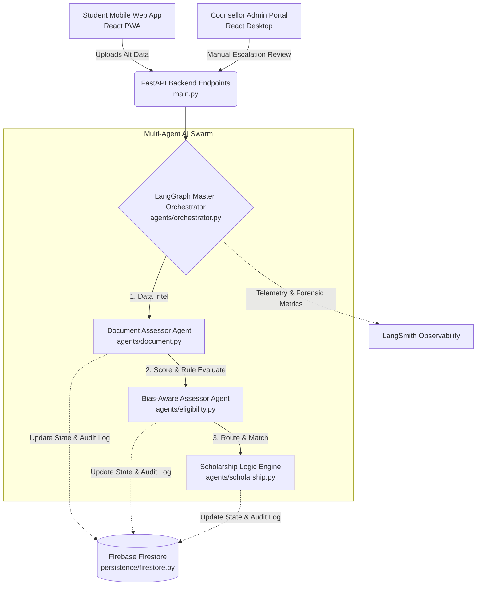
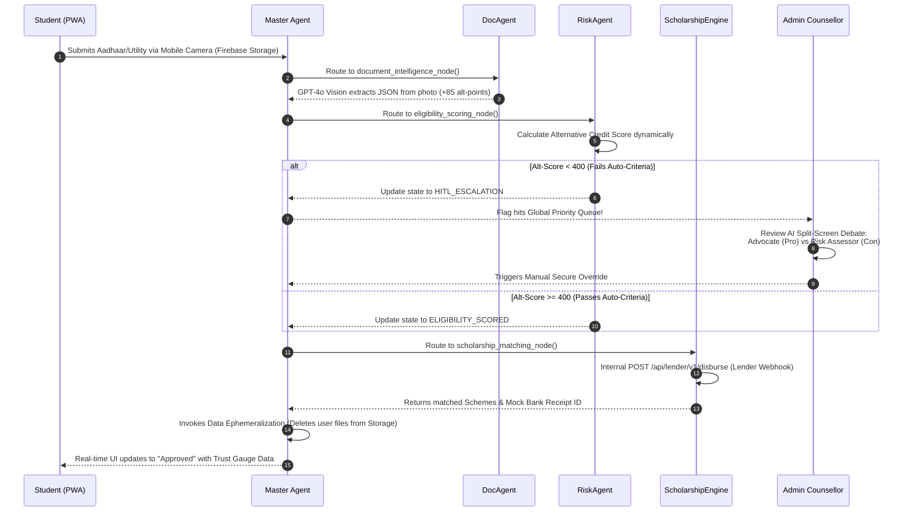

# SPARC-Agent 🚀

**An AI-driven, stateful, multi-agent orchestration architecture for democratizing student finance.**

Built for the 24-hour Hackathon. Millions of deserving Indian students fail to access higher education due to a fragmented process and lack of formal CIBIL/income proof. SPARC-Agent solves this by functioning as a "Financial Aid Office in a pocket," using Alternative Data Credit Scoring and a rigorous explainable edge-case escalation layer.

---

## 🏗️ System Architecture

SPARC operates on three distinct layers that communicate through a single persistent Source of Truth (Firebase). The backend utilizes a strictly routed graph of autonomous agents perfectly eliminating hallucination risks.



### Agent Breakdown (By File)
- **`backend/agents/orchestrator.py` (The Master Agent)**: Stitches the entire workflow together sequentially using `LangGraph`. Handles error rollback resiliency. Triggers **Data Ephemeralization** hooks to instantly delete uploaded documents from Cloud Storage after the run to maintain privacy compliance.
- **`backend/agents/document.py` (Document Intel)**: Ingests unstructured files via secure Firebase Storage URLs. Powered crucially by `gpt-4o` (Vision via `langchain-openai`), it visually parses Alternative Data like Academic Transcripts and basic Utility Bills, automatically emitting structured proxy attributes to bypass the need for formal ITR documents.
- **`backend/agents/eligibility.py` (Risk Assessor)**: A Bias-Aware scoring model that computes a dynamic Alternative Credit Score (0-1000). If this calculates poorly, **it halts the autonomy** and escalates to a human operator via the Admin Command Center (where PII data masking auto-blurs identities).
- **`backend/agents/scholarship.py` (The Logic Engine)**: Navigates 400+ government and private lender schemes to return optimal paths. It completes its run by sending a live HTTP POST to our dedicated Mock Bank API (`/api/lender/v1/disburse`) to trigger the final disbursal receipt.

---

## 🛤️ Autonomous User Flow Engine

When a student hits the endpoint, this is exactly what happens linearly under the hood:



### Flow Highlights:
- **Zero Hallucination Logging**: At every step in the `sequenceDiagram`, the sub-agent constructs a "plain-English" thought reasoning array. This array is continuously streamed to the global `StudentJourneyState` interface in Firebase.
- **The Split-Screen Human Layer**: If Step 5 executes, the Admin doesn't just see a "Rejected" flag. They see the AI debate exactly *why* they failed (The Risk Assessment Node parameters) contrasted against *why* they could be a good fit (The Advocate Node processing their extracurricular NLP).

---

## 🛠️ Run it Locally

**1. Backend Orchestrator:**
```bash
cd backend
python -m venv venv
.\venv\Scripts\activate
pip install -r requirements.txt
python main.py
```
*(Runs on localhost:8000)*

**2. Student PWA:**
```bash
cd frontend-student
npm install
npm run dev
```

**3. Admin Resolution Center:**
```bash
cd frontend-admin
npm install
npm run dev
```
