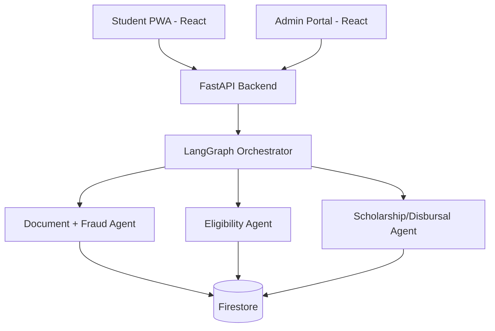

# SPARC-Agent

AI-driven, stateful multi-agent platform for student-finance onboarding, document fraud prevention, eligibility scoring, and disbursal readiness.

## Overview

SPARC helps students who may lack traditional credit proof by using alternative data, explainable fraud checks, and human-in-the-loop escalation when risk is uncertain.

Core capabilities:
- Multi-agent orchestration with persistent journey state.
- 4-layer fraud prevention with trust score output.
- Admin escalation review workflow for medium/high risk cases.
- Bank details tokenization flow for disbursal readiness.
- Full audit trail for compliance and explainability.

## Architecture



### Key backend modules
- `backend/agents/orchestrator.py`: routes workflow, handles journey transitions.
- `backend/agents/document.py`: document intelligence + fraud-layer integration.
- `backend/agents/fraud_detection.py`: validation, fuzzy matching, risk scoring.
- `backend/routers/lender.py`: bank details and disbursal-related APIs.
- `backend/main.py`: API app entry and routing.

## Fraud Prevention System (4 Layers)

### Layer 1: Format validation
- Aadhaar checksum validation (Verhoeff).
- PAN format validation (NSDL-style checks).
- Utility account format checks.
- Hard invalids can be auto-rejected quickly.

### Layer 2: Cross-document matching
- Fuzzy name matching across Aadhaar/PAN/Utility.
- Fuzzy address matching for consistency.
- Threshold-based penalties for mismatch patterns.

### Layer 3: Vision-based document analysis
- Blur scoring.
- Tampering/forgery signal checks.
- Readability and security feature checks (for supported docs).

### Layer 4: Risk scoring and action routing
- Aggregates prior layer signals into a trust score (0-100).
- Default decision matrix:
  - `85-100`: Auto-approve (low risk)
  - `70-84`: Manual review (medium risk)
  - `50-69`: Manual review (high risk)
  - `0-49`: Auto-reject (critical risk)

### Typical performance targets
- End-to-end detection: ~10-20 seconds per application.
- High auto-approval with low manual-review burden.
- Complete audit trail for every decision.

## Journey and Escalation Flow

1. Student uploads documents.
2. Orchestrator runs document + fraud checks.
3. System computes trust score and risk level.
4. Outcome:
   - Low risk: continue to eligibility/disbursal flow.
   - Medium/high risk: send to admin escalation panel.
   - Critical risk: fraud lockout/reject path.
5. Admin can approve/reject/escalate for more docs; decision is logged.

## Admin Escalation Panel (What it includes)

- Pending queue sorted by risk and recency.
- Case detail with:
  - Trust score and fraud flags.
  - Layer-by-layer breakdown.
  - Document previews and AI notes.
  - Audit trail context.
- Admin actions:
  - Approve
  - Reject
  - Request more documents
- On approval, journey resumes to downstream eligibility/disbursal steps.

## Bank Details Tokenization

### Why this design
- Avoids storing full account numbers directly.
- Uses tokenized identifiers and masked account display (`XXXX1234`).
- Supports fintech-style security posture and cleaner compliance story.

### Data captured
- Account holder name
- Bank name
- Masked account suffix
- `tokenized_account_id`
- Verification timestamp

### API endpoints
- `POST /api/lender/v1/bank-details`: store tokenized bank details.
- `GET /api/lender/v1/bank-details/{user_id}`: fetch masked verified details.
- `POST /api/lender/v1/disburse`: should verify bank details before transfer.

### Storage pattern
- Journey state stores metadata/flags.
- Sensitive bank-record document stored in separate collection (`student_bank_accounts`) with restricted access.

## Security and Compliance Notes

- No full bank account number persistence in normal flow.
- Masked outputs only for retrieval endpoints.
- Layered fraud defense lowers spoofing risk.
- Human-in-the-loop review for ambiguous cases.
- Audit logs preserve explainability for review and governance.

## Testing Checklist

- Fraud:
  - Valid docs pass and produce high trust scores.
  - Clear checksum/format failures reject correctly.
  - Name/address variance triggers review where expected.
  - Vision signals impact risk score as designed.
- Bank details:
  - Form validation catches bad inputs.
  - Tokenized details save and fetch correctly.
  - Disbursal blocks when bank details are missing.
  - No sensitive account data leaks in logs/responses.

## Run Locally

### Backend
```bash
cd backend
python -m venv venv
.\venv\Scripts\activate
pip install -r requirements.txt
python main.py
```

### Student frontend
```bash
cd frontend-student
npm install
npm run dev
```

### Admin frontend
```bash
cd frontend-admin
npm install
npm run dev
```
