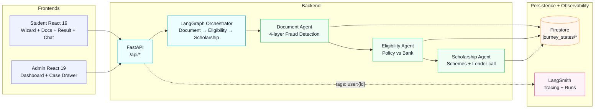
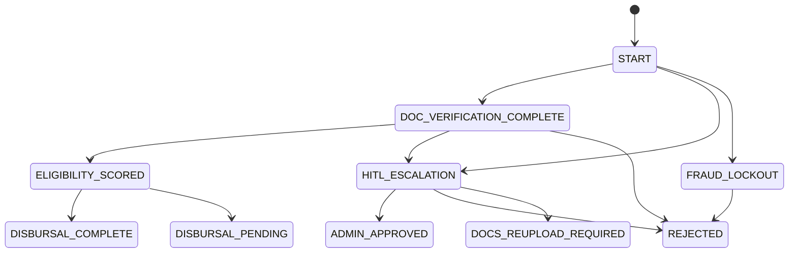

# FinFlow AI (SPARC) — Production‑grade AI fintech demo

TEAM NAME: PENTAFLUX
TEAM NUMBER: 9
PS: 4
Team Members:
Suryansh Anand
Amrit Gaurav Ray
Swatam Kumar Panda
Moumita Dash
Anwesha Sharma

FinFlow AI is a multi‑agent fintech platform for **education loan onboarding** with:
- **Ephemeral documents** (base64 in → agent verification → zero retention)
- **4‑layer fraud detection** (format → cross‑match → vision → trust score)
- **Dual‑engine eligibility** (Govt policy vs strict bank rules)
- **Scholarship matching + lender disbursal mock**
- **Admin HITL console** (review / lock / approve / reject) with **audit logs + AI analyst**

## Live apps (dev)
- **Student app**: `http://localhost:5173` (Vite)
- **Admin app**: `http://localhost:5174` (Vite)
- **Backend**: `http://localhost:8000` (FastAPI + LangGraph)

## System architecture (high level)



## Agents & responsibilities (roles)

- Master Orchestrator (LangGraph): `backend/agents/orchestrator.py`
  - Controls the journey state machine and routing between stages
  - Persists the final `journeyStatus` / `journeyState` back to Firestore

- Document Intelligence Agent: `backend/agents/document.py`
  - Implements 4-layer fraud detection
  - Runs GPT-4o Vision extraction through a LangChain OpenAI wrapper
  - Produces structured verification output + `trustScore` / `fraudRiskLevel`

- Eligibility / Risk Engine: `backend/agents/eligibility.py`
  - Computes risk from policy vs bank rules (FOIR, CIBIL-like thresholds)
  - Determines whether the flow can auto-proceed or must escalate to admin

- Scholarship & Loan Matching Agent: `backend/agents/scholarship.py`
  - Builds top scholarship schemes (keeps UI simple by showing only a limited set)
  - For loan scenarios, triggers the lender disbursal mock

- Admin Analyst (human-in-the-loop assistant): `POST /api/admin/escalations/{user_id}/analyze`
  - `backend/main.py` generates an evidence-based admin note (trust, risks, clarifications)

- Lender disbursal mock (loan component): `backend/routers/lender.py`
  - `POST /v1/disburse` simulates a bank/NBFC decision and returns a `receipt_id`

## LangGraph + LangChain + Firebase in practice

- Firebase Auth: students/admin sign in via Google OAuth.
- Firestore persistence: `journey_states/{user_id}` stores the current `journeyStatus/journeyState`, extracted profile data, and audit evidence.
- Document handling: the student sends images for verification; after orchestration, the backend attempts **ephemeralization** by deleting uploaded blobs from Firebase Storage.
- LangChain + GPT-4o Vision: document verification/extraction is done by the Document Intelligence agent using `langchain_openai` wrappers.
- LangSmith tracing: orchestrations are tagged with `user:{firebase_uid}` so you can find the exact run during demos.

## Journey state machine



## Demo workflow (fast showcase)

### Student: “Demo Verified” + “Auto‑Fill Remaining”
- **Home page**: 3 scenario buttons
  - **Approved** → reaches `DISBURSAL_COMPLETE`
  - **Mismatch** → reaches `HITL_ESCALATION`
  - **Rejected** → reaches `REJECTED`
- **Explore Funding**: shows simplified, limited offer cards (loans 2–3, scholarships 2–3).
  - In the `ADMIN_APPROVED` demo path, the student is told what’s available and does not need to choose.
- **Documents step**: each doc has a **⚡ Demo Verified** button (marks it as uploaded/verified)
- **From Profile → Result**: a persistent **Demo Verified bar** appears with:
  - Scenario selector (Approved / Mismatch / Rejected)
  - **⚡ Auto‑Fill Remaining** (fills missing fields + marks missing docs as demo‑verified)
  - For `ADMIN_APPROVED`, the result screen displays auto-selected “Scholarship or Loan” offers (guaranteed at least one option for demo consistency)

This keeps the demo “live at every step” so you never have to retype details during a showcase.

### Admin: live escalation queue + audit evidence
- Admin dashboard polls `GET /api/admin/escalations` and updates the queue in near real time.
- Each case drawer shows Firestore state + `audit_trail` / `agentMemory` so admin decisions are explainable.
- For demos, if the backend has no cases yet, the UI can still keep the walkthrough smooth with placeholders.

### Admin: click into a case → logs + AI analyst
In Review / Locked, click **“View Profile & Logs”** to open a drawer showing:
- **Firestore state snapshot** (profile + journey status)
- **Firebase agent logs** (`auditTrail` / `agentMemory`)
- **LangSmith trace discovery hints** (tags like `user:{id}`)
- **AI Admin Analyst**: evidence-based recommendation + clarifications to request

## Key backend APIs

### Core
- `GET /health`
- `GET /api/state/{user_id}`
- `POST /api/orchestrate`
  - Runs LangGraph pipeline and persists updated state
  - Adds LangSmith tags `finflow`, `user:{id}`, `event:{event}`
- `POST /api/chat`

### Admin
- `GET /api/admin/escalations`
- `POST /api/admin/escalations/{user_id}/decision`
- `GET /api/admin/escalations/{user_id}` (case drawer details)
- `POST /api/admin/escalations/{user_id}/analyze` (AI admin analyst)

## Persistence model (Firestore)
- `journey_states/{user_id}`
  - Writes **both** `journeyStatus` and `journeyState`
  - Writes **both** `profile` and `studentProfile`
  - Writes **both** `audit_trail` and `agentMemory`

## How to run (Windows / PowerShell)

### Backend
```bash
cd backend
python -m venv venv
.\venv\Scripts\activate
pip install -r requirements.txt
python main.py
```

### Student frontend
```bash
cd frontend-student
npm install
npm run dev -- --port 5173
```

### Admin frontend
```bash
cd frontend-admin
npm install
npm run dev -- --port 5174
```

## LangSmith tracing (how to find runs during demo)
- Ensure env enables tracing (e.g. `LANGCHAIN_TRACING_V2=true`)
- Orchestrations are tagged with `user:{user_id}`
- In LangSmith UI, filter by tag: `user:<the firebase uid>`
